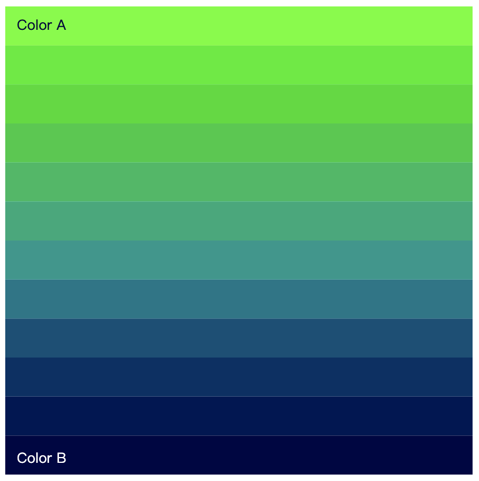

# wxue0283_9103_tut01

## **1.Imaging Technique Inspiration**

 **[A link to the artwork]** (https://www.xiaohongshu.com/explore/6537a63e000000001e02f2d4)

What I am inspired in this artwork is that the visual effect where lines split into different colored branches, then converge and recombine themselves into the original form. The harmonious *color gradient* adds a sense of visual richness to the orderly shapes or layout without making the original artwork (our group is probably doing the ‘Apple Tree’) appear chaotic. Moreover, *the change of color creates a sense of rhythm*, which I think would be perfect for audio-based animation. I might be able to combine this dynamic with the frequency or form the waveform of audio clips to create a harmonious sense of movement within the artwork.

### **Example screenshots**

## **2.Coding Technique Exploration**

**[A link to the coding technique]** (https://p5js.org/examples/color-lerp-color.html)

  I found a piece of code on the p5.js website called "lerpColor." This technique helps generate intermediate colors between colors A and B. I believe this method allows for smooth and harmonious color transitions while the graphics are in motion. For example, I can create a branching and merging line effect by arranging many small rectangles and grouping them. Then, by applying "lerpColor" to each group, every branch can own a nice gradiant so as to achieve a visual effect similar to the inspiration artwork.

 ### **Example Screenshot**
 